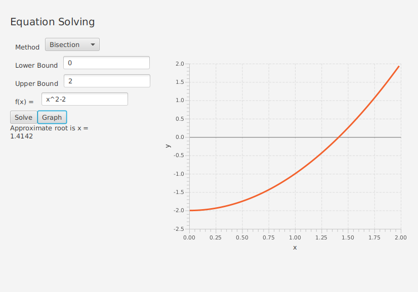
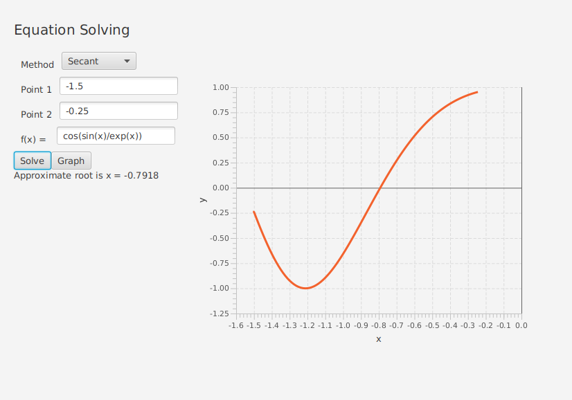

# NumericMaths
Interactive program implementing numerical maths methods to help me learn Java and JavaFX

Currently implements the bisection and secant method for finding roots of equations. 
Equations are parsed using the shunting yard algorithm to get a reverse polish representation.

